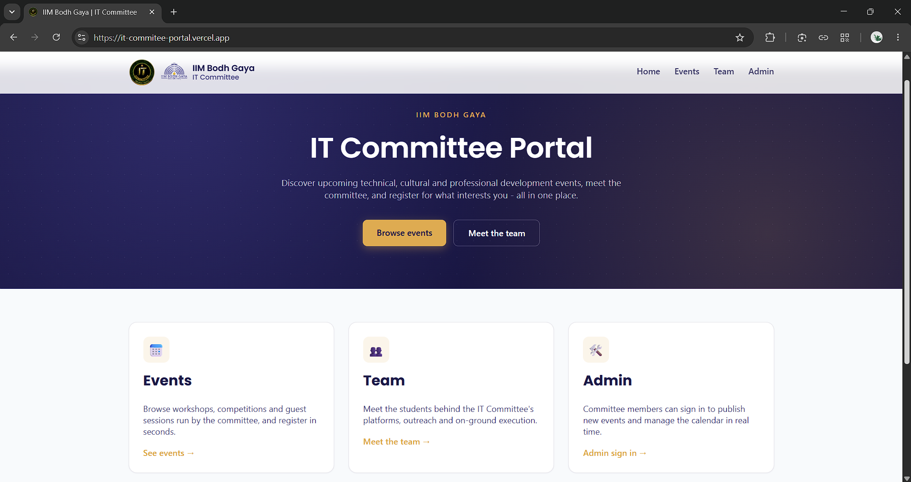

# IIM Bodh Gaya — IT Committee Portal

A responsive web portal for the IT Committee, IIM Bodh Gaya: browse and search events, register
for them, meet the team, and (for committee admins) manage the event calendar from a protected
admin panel — all backed by Firebase.

## Setup & Run

1. Create a Firebase project at the [Firebase console](https://console.firebase.google.com/), add
   a Web app, and enable **Firestore Database** and **Authentication → Email/Password**. Add one
   admin user under Authentication → Users.
2. Publish the rules in [`firestore.rules`](firestore.rules) to your project's Firestore → Rules tab.
3. Open [`js/firebase-config.js`](js/firebase-config.js) and paste in your project's config values
   (`apiKey`, `authDomain`, `projectId`, `storageBucket`, `messagingSenderId`, `appId`).
4. Open `index.html` in a browser — no build step or install required. Sign in at
   `admin/index.html` with your admin user to add events.

## Screenshot

## Features Completed

- [x] Events section rendered from Firestore (not hardcoded), loop-generated by `js/events.js`
- [x] Search by event name + filter by category
- [x] Team page with card layout (avatar, name, role, one-line bio), rendered from `js/team-data.js`
- [x] Event registration form with client-side validation, stored in Firestore (`registrations` collection)
- [x] Fully responsive layout (hand-written CSS media queries, mobile nav)
- [x] Authenticated admin panel (Firebase Auth) to create/edit/delete events, reflected live on the
      public events page via a real-time Firestore listener (`onSnapshot`)
- [x] Firestore security rules restricting event writes and registration reads to authenticated admins

## AI Usage

AI tools were used as development assistants during this project. **Claude Code** helped generate initial code templates and implementation suggestions for certain frontend components and **Firebase** integration. **ChatGPT** was used for brainstorming and documentation support.

The project architecture, UI customization, feature implementation, Firebase setup, debugging, testing, deployment, and all final technical decisions were completed by the author. AI-generated code was treated as a starting point and was reviewed, adapted, and integrated into the final application.

